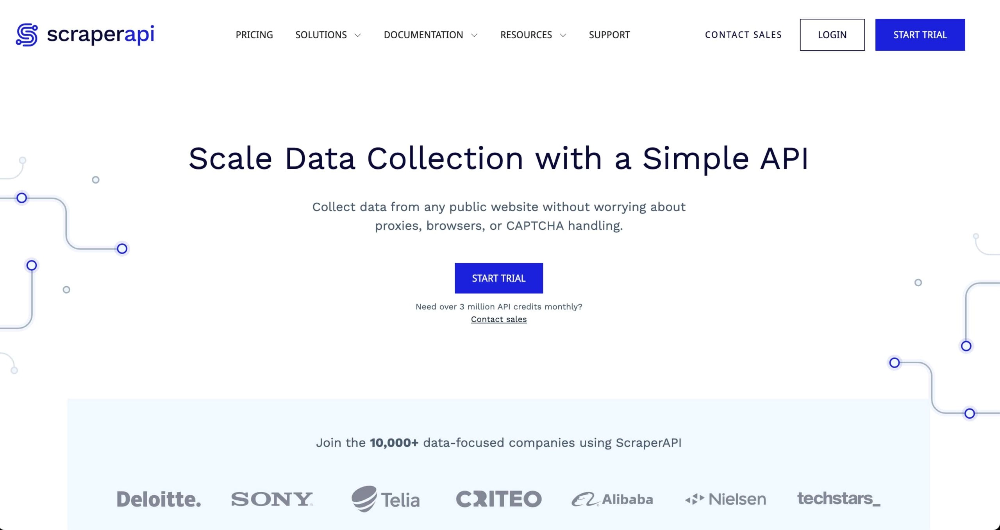

# ScraperAPI测评2025：轻松实现大规模数据采集

---

做过网络爬虫的人都知道，写代码抓数据这事儿，听起来简单，实际上坑多得要命。IP被封、验证码拦路、反爬虫机制越来越狠——折腾半天可能连个像样的数据都拿不回来。如果你正在寻找一个能帮你绕过这些麻烦、直接拿到数据的工具，ScraperAPI或许值得一试。它不需要你自己搭代理池，不需要手动处理验证码，甚至不需要你懂太多技术细节——只要几行代码，就能开始大规模采集数据。

---

## 什么是ScraperAPI？

说白了，ScraperAPI就是一个专门帮你搞定网络数据采集的API服务。

传统的数据抓取方式，你得自己用Python、JavaScript之类的语言写脚本，再配合Selenium或Puppeteer这些库去模拟浏览器操作。听起来还行，但真做起来你会发现：代理要自己找、IP池要自己维护、验证码要自己破解、反爬虫策略要自己研究……一不小心IP就被封了，整个流程卡在那儿动不了。

ScraperAPI把这些烦人的活儿全包了。它支持Python、JavaScript、Java、Ruby和PHP等主流编程语言，官方文档写得挺清楚，照着来基本不会出错。更关键的是，它能自动处理验证码、自动轮换代理IP、控制请求频率——这些原本需要你花大量时间去折腾的事情，现在都交给ScraperAPI的AI模型自动搞定。



除了基础的爬虫API，ScraperAPI还提供数据管道、异步抓取服务以及大规模数据采集方案。如果你只是想先试试效果，可以申请7天免费试用，看看是否符合你的需求。

## ScraperAPI的几个实用功能

**IP地理定位：** 如果你需要抓取特定国家或地区的数据（比如美国亚马逊的商品信息），ScraperAPI能帮你切换到对应地区的代理IP。它的代理池覆盖全球多个国家，数量以百万计，基本不用担心IP不够用。

**无限带宽：** 不像有些服务限制你每月只能跑多少流量，ScraperAPI不限带宽。你可以放心大胆地抓大量数据，不用担心流量用完了还得加钱。

**99.99%的在线率保证：** 做爬虫最怕的就是服务突然挂了，数据抓到一半直接中断。ScraperAPI承诺99.9%的在线率，对于需要长期稳定运行的项目来说，这点挺重要。

**扩展性强：** 无论你是个人项目每天抓几千条数据，还是企业级需求每月跑几百万次请求，ScraperAPI都能扛得住。如果是超大规模的项目，还可以直接联系他们的团队定制方案。

## 怎么用ScraperAPI？（以NodeJs为例）

ScraperAPI的集成方式有好几种，可以直接调API端点，也可以用代理端口或SDK。这里我用NodeJs的SDK方式演示一下，因为这种方式最简单直接。

### NodeJs集成示例：

```javascript
const ScraperAPI = require('scraperapi-sdk');
const apiKey = 'YOUR_SCRAPERAPI_KEY'; // 替换成你自己的API密钥
const scraper = new ScraperAPI(apiKey);

async function scrapeWebsiteContent(url) {
  try {
    let response = await scraper.get(url);
    console.log('抓取到的数据:', response);
  } catch (error) {
    console.error('抓取出错:', error);
  }
}

let url = 'https://google.com'; // 替换成你要抓的网址
scrapeWebsiteContent(url);
```

**注意：** 运行这段代码之前，你得先在项目里装一下SDK。在终端输入`npm install scraperapi-sdk`就行，等它装完再跑代码。

### 代码逻辑解释：

整个流程其实很简单。首先引入ScraperAPI的SDK包，然后填上你注册账号后拿到的API密钥。接着初始化一个ScraperAPI客户端实例，把密钥传进去。

核心部分是那个异步函数`scrapeWebsiteContent`，它接收一个网址作为参数。函数里用了`try-catch`结构来捕获可能出现的错误——比如网络问题、目标网站挂了之类的。在`try`块里，调用`scraper.get(url)`方法向ScraperAPI发起请求，👉 [想了解如何绕过更复杂的反爬虫机制？点这里看ScraperAPI的完整功能](https://www.scraperapi.com/?fp_ref=coupons)。请求成功后，数据会返回到`response`变量里，然后打印出来。

最后定义一个要抓取的网址（比如谷歌首页），调用函数执行就完事了。

## 其他值得一提的功能

除了上面说的那些，ScraperAPI还有不少实用特性，而且这些功能在所有付费套餐里都包含：

- **智能代理轮换：** 自动切换IP，避免被目标网站识别和封禁
- **自动重试机制：** 请求失败了会自动重试，不用你手动处理
- **自定义会话支持：** 需要保持登录状态？可以用会话功能
- **高级代理池：** 提供更稳定、更快速的高级代理选项
- **自定义请求头：** 可以自己设置User-Agent、Referer等请求头信息
- **验证码和反爬虫检测：** AI自动识别并绕过各种验证机制
- **JSON自动解析：** 返回的数据自动格式化成JSON，省得你再写解析代码

👉 [想看详细的价格方案？直接去官网对比各个套餐](https://www.scraperapi.com/?fp_ref=coupons)，根据你的数据量需求选一个合适的。

---

## 总结

网络爬虫这件事，技术门槛其实不算太高，但要做好、做稳定，需要投入大量精力去处理各种细节问题。ScraperAPI的价值就在于它把那些繁琐的底层工作全包了——代理管理、验证码处理、反爬虫应对、请求重试……这些原本需要你花几周甚至几个月去摸索的东西,现在几行代码就搞定。对于需要快速上线数据采集项目、或者不想在基础设施上浪费时间的开发者来说，ScraperAPI确实是个省心的选择。
